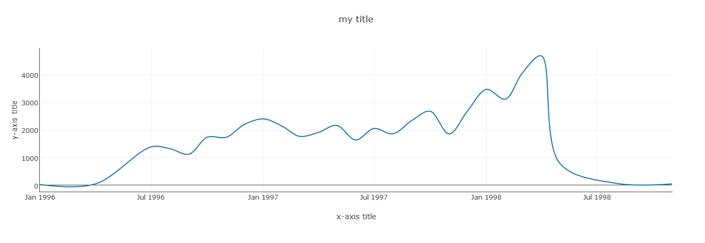

DESCRIPTION
------------
  

Dashboard Builder is a PHP liberary based data driven visualization & business analtyc tool, a machine learning delivers insights, written in PHP with an added layer of drag-and-drop flexibility which helps predicting the future with ease and no code required.

Dashbaord Builder generates PHP and Universal HTML code for your dashboard and integrate it seamlessly into any web application written in PHP or any PHP frameworks like Wordpress, Laravel, CodeIgniter, Joomla and other.

REQUIREMENTS
-------------------------
    PHP Version 7.2 or later 
    Apache 2 or later,  Nginx or any other Servcers support PHP
    Windows 7 or later /Linux 3 or later/Ubuntu or any other platforms support Apache, Nginx etc.
    Firefox 52, Chrome 57, IE 8, or any other Browsers support SVG

INSTALLATION 
------------

INSTALLER
.........

1) Extract the product archive in web root. e.g. www.dashboarduilder
2) Open it in browser to run installer. e.g. http://localhost/ dashboarduilder

Via Composer 
............
	composer require dashboardbuilder/dashboardbuilder.net

INTEGRATION
-----------
- For integration in your app, you need to copy the PHP code to your php application.

1) The folder "inc", “assets” and “css” will be replaced by path where you place 'lib' folder (if changed)

<pre>
 &lt;script src="assets/js/dashboard.min.js"&gt;&lt;/script&gt;&nbsp; &lt;! --&nbsp; copy this file to assets/js folder -- &gt;
 &lt;link rel="stylesheet" href="css/bootstrap.min.css"&gt; &lt;! --&nbsp; Bootstrap CSS file, change the path accordingly -- &gt;
</pre>

2) Update include path where you place “inc/dashboard_dist.php”. (if changed)

	Include(“inc/dashboard_dist.php");
Refer 'Getting Started' section on https://dashboardbuilder.net/php-dashboard for more details.

Refer 'Support' on https://dashboardbuilder.net/support for queries and support.

LICENSE
-------
Must read and agree LICENSE.txt before use.

RESULT
------

PHP CODE
-------
<pre>
&lt;?php
/**
 * DashboardBuilder
 *
 * @author Diginix Technologies www.diginixtech.com
 * Support &lt;support@dashboardbuider.net&gt; - https://www.dashboardbuilder.net
 * @copyright (C) 2017 Dashboardbuilder.net
 * @version 2.1.0
 * @license: license.txt
 */

include(&quot;inc/dashboard_dist.php&quot;);  // copy this file to inc folder 

// for chart #1
$data = new dashboardbuilder(); 
$data-&gt;type =  &quot;line&quot;;

$data-&gt;source =  &quot;Database&quot;; 
$data-&gt;rdbms =  &quot;sqlite&quot;; 
$data-&gt;servername =  &quot;&quot;;
$data-&gt;username =  &quot;&quot;;
$data-&gt;password =  &quot;&quot;;
$data-&gt;dbname =  &quot;dataNorthwind.db&quot;;
$data-&gt;xaxisSQL[0]=  &quot;SELECT strftime(^%Y-%m^,o.orderdate) as xaxis, sum(d.quantity) as yaxis from `order details` d, orders o  where o.orderid = d.orderid group by strftime(^%Y-%m^,o.orderdate) limit 50&quot;;
$data-&gt;xaxisCol[0]=  &quot;xaxis&quot;;
$data-&gt;yaxisSQL[0]=  &quot;SELECT strftime(^%Y-%m^,o.orderdate) as xaxis, sum(d.quantity) as yaxis from `order details` d, orders o  where o.orderid = d.orderid group by strftime(^%Y-%m^,o.orderdate) limit 50&quot;;
$data-&gt;yaxisCol[0]=  &quot;yaxis&quot;;

$data-&gt;name = &quot;col1&quot;;
$data-&gt;title = &quot;my title&quot;;
$data-&gt;xaxistitle = &quot;x-axis title&quot;;
$data-&gt;yaxistitle = &quot;y-axis title&quot;;

$result[1] = $data-&gt;result();?&gt;

&lt;!DOCTYPE html&gt;
&lt;html&gt;
&lt;head&gt;
	&lt;script src=&quot;assets/js/dashboard.min.js&quot;&gt;&lt;/script&gt; &lt;!-- copy this file to assets/js folder --&gt;
	&lt;link rel=&quot;stylesheet&quot; href=&quot;css/bootstrap.min.css&quot;&gt; &lt;!-- Bootstrap CSS file, change the path accordingly --&gt;
	
&lt;style&gt; 
&lt;!-- adjust the height width as per your need --&gt;;
/*
#col0{
height:350px;
}
#col1{
height:350px;
}
*/
&lt;/style&gt;

&lt;/head&gt;
&lt;body&gt; 
&lt;div class=&quot;container&quot;&gt;

&lt;div class=&quot;col-lg-12&quot;&gt;
&lt;div class=&quot;panel panel-default&quot;&gt;
&lt;div class=&quot;panel-heading&quot;&gt;&lt;/div&gt;
	&lt;div class=&quot;panel-body&quot;&gt;
		&lt;?php echo $result[1];?&gt;
	&lt;/div&gt;
&lt;/div&gt;
&lt;/div&gt;
&lt;/div&gt;
&lt;/body&gt;
</pre>
